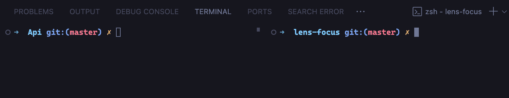
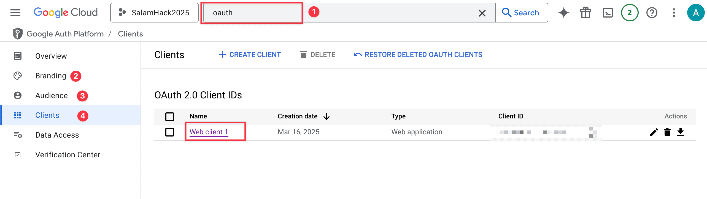

# LensFocus

## AI-Powered Cross-Platform Review & Comment Analyzer

### 🎯 Project Concept

In today’s fast-paced digital world, businesses and content creators are overwhelmed by scattered, unstructured feedback across multiple platforms — Amazon, YouTube, Facebook, and more. Manually sifting through thousands of reviews and comments to extract meaningful insights is slow, tedious, and inefficient.
Our solution: A Generative AI-Driven Cross-Platform Review Analyzer — an all-in-one tool designed to aggregate, summarize, analyze, and visualize feedback from diverse sources, empowering businesses and content creators with data-driven, actionable insights.

### 🚀 Key Features

#### 🔗 Unified Comment Aggregation

- Connects and centralizes comments, reviews, and feedback from multiple platforms into one dashboard — no more juggling between tabs.
- Supports Amazon, YouTube, Facebook, and other major e-commerce or content platforms.

#### 📝 AI Review Summarization

- Analyzes large volumes of reviews and distills them into concise, digestible summaries, highlighting key positives, negatives, and neutral points.
- Example: “80% of buyers praise the battery life; 20% report heating issues.”

#### 😡😐😊 Sentiment Analysis

- Automatically determines the emotional tone (positive, negative, neutral) behind the feedback, assigning confidence scores to ensure accuracy.
- Businesses can monitor product sentiment shifts over time to spot emerging issues or wins.

#### ✅ Actionable Insight Extraction

- Detects recurring patterns and trends in feedback, generating a list of actionable recommendations to improve products or content.
- For example: "Customers often complain about late deliveries — prioritize logistics improvements." or "Viewers enjoy behind-the-scenes content — create more."

#### 📊 Business Intelligence Dashboard

- Generates interactive visual dashboards with graphs, metrics, word maps, and keyword analysis, offering a comprehensive overview of performance and sentiment trends.
- Keyword maps reveal high-impact phrases and associated terms for better SEO and content optimization.

#### 🔥 Ad Performance Insights

- Analyzes comments on ads to assess how the audience perceives them, determining whether they resonate positively or generate backlash.
- Helps businesses refine ad strategies for better engagement and ROI.

#### 💬 AI-Powered Review Chat

- Users can chat with the AI to ask questions about the reviews: "What’s the most common complaint about this product?" or "Which video type gets the best engagement?"

### 🎯 Tailored Use Cases

#### 🛍️ For E-Commerce Businesses

- Product Optimization: Identify the top-performing product variations and areas for improvement.
- Monitor Marketplace Performance: Track seller reputation and flag poor-performing listings.
- Boost Conversions: Display AI-generated summaries directly on product pages to help customers make faster, smarter purchase decisions.
- Keyword Strategy: Discover high-impact, niche keywords based on real user feedback to optimize product listings and ads.

#### 🎥 For Creators and media Businesses

- Content Strategy Guidance: Analyze comments to identify which video formats, topics, and styles resonate most with viewers.
- Performance Breakdown: Determine which videos drive the most engagement and why.
- Audience Understanding: Extract viewer sentiment to tailor future content to audience preferences.

### 💡 Business Value Proposition

Our tool offers measurable value to businesses and creators alike:

- 🚀 Speed & Scalability: Processes massive volumes of comments within seconds, helping teams focus on action — not data collection.
- 💸 Cost Efficiency: Reduces the need for manual review analysis and social listening services.
- 📌 Time-Saving: Customers skip scrolling through endless reviews — they get fast, high-impact summaries.
- 🔍 Deeper Insights: Analyzes the entire dataset, not just a random sample, leading to more reliable, data-backed decisions.
- 📈 Continuous Improvement: Businesses track performance over time and stay ahead of market sentiment shifts.
- 🔧 Proactive Problem Solving: Quickly identifies rising issues, giving businesses a chance to respond before backlash grows.

# How to run

## Step 1: Install the required libraries

`Make sure you have NodeJs and Angular installed first`

After downloading the repo to your local machine:

- Go to the folder you downloaded and open it in VS code or your preferred code editor.
- Make sure you are in `SALAMHACK_2025` Folder then Open two terminal windows.
  
- Navigate to the `lens_focus` directory and run `npm install`.

```bash
cd ./lens_focus && \
npm install && \
ng server
```

- In the second terminal window, navigate to the `Api` directory and run `npm install`

```bash
cd ./Api && \
npm install
```

## Step 2: Create environment variables

- Create a new file named `.env` in the `./Api` of the project and add the following lines

```bash
JWT_SECRET = "wirte your secrets here"
MONGO_DB= "wirte your secrets here"
GOOGLE_CLIENT_ID= "wirte your secrets here"
GOOGLE_CLIENT_SECRET= "wirte your secrets here"
REDIRECT_URI="http://localhost:3000/api/auth/googleCallback"
YT_API_KEY = "wirte your secrets here"
Gemini ="wirte your secrets here"
```

### JWT_SECRET

- You can use any string as your secret key, but make sure it is a strong one.

### MONGO_DB

- Go to `https://www.mongodb.com` and create an account, then create a new cluster, then create a new database and put your secret here. youtube have a lot of videos if you feel confused.

### GOOGLE SET UP

- Go to `https://console.cloud.google.com/` and create a new project.
- Search for `OAuth Consent screen` in the serach bar
- click on branding and fill in your details. - In `application home page` write: `http://localhost:4200`
- In `Authorized domains` write: `localhost.com`
- Go to audience page then under test user click `Add users` and add your own email. This email will be used to login to your app.
- In clients page press `Create cleint` and select `Web application`. name it anything. The `Authorized origins` must be `http://localhost:4200` and `Authorized redirect URIs` must be `http://localhost:3000/api/auth/googleCallback`. press save
- In Data access Click `add or remove scope` and search for `youtube.readonly` and `YOUTUBE_FORCE_SSL`. select it then press update.
  
- you need to get a youtube api as well and add it to `YT_API_KEY`

#### GOOGLE_CLIENT_ID

- Click clients then under `OAuth 2.0 client IDs` then select the name you just created
- copy the `client ID` and paste it in your `.env` file

#### GOOGLE_CLIENT_SECRET

- copy the `Client secret` and paste it in your `.env` file

## Gemini

- Go to `https://aistudio.google.com`
- on the to left click on `Get api key`
- add it to the `.env` file

Now all the keys are added to the `.env` file

## Step 3: Run the project

- close both terminals first to make sure the the `.env` files are saved and running on the new session.
- Make sure you are in `SALAMHACK_2025` Folder then Open two terminal windows.
- Navigate to the `lens_focus` directory and run `ng server`. This will start the Angular development server.

- In the second terminal window, navigate to the `Api` directory and run `npm index.js`
